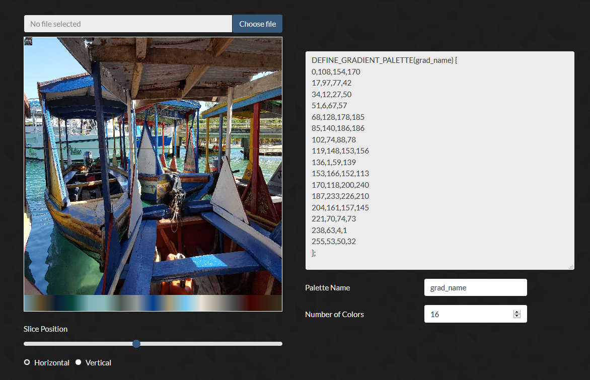

# FastLED Image -> Gradient Tool

## What is this?

This is a web app for generating FastLED gradient palettes from images.

## Usage

* Upload a file using the "Choose File" button.
* Use the slider below the image to select where to pull colors from.
  - You can slice colors either vertically or horizontally
* Change the gradient name and number of colors (between 1 and 32) below the palette output.
* Copy your palette into Arduino and check out your colors!
 - Not sure how to use FastLED gradient palettes? [Check out the docs!](https://github.com/FastLED/FastLED/wiki/Gradient-color-palettes)
